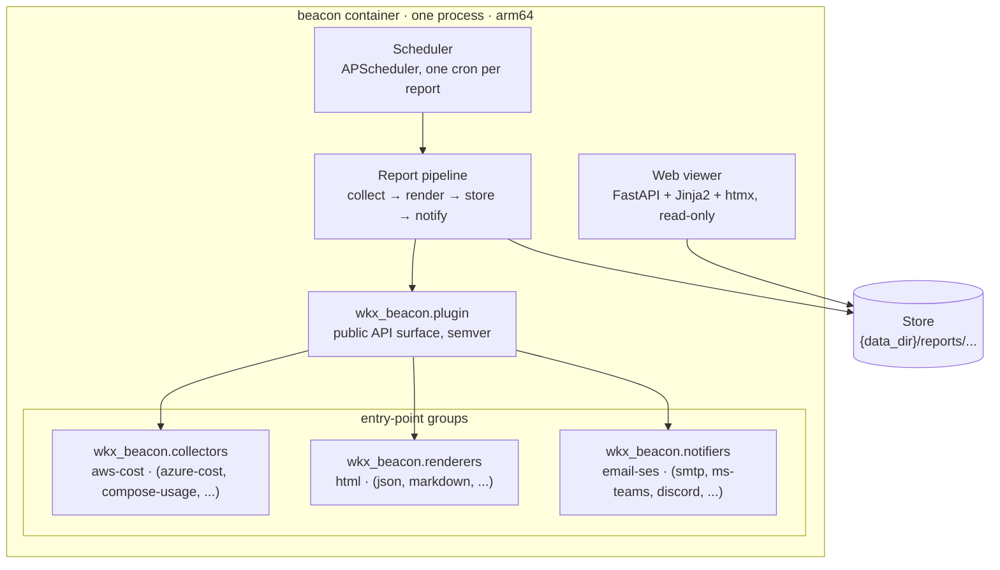

# wkx-beacon

Beacon generates reports about the platform it runs on and announces them. It is an open-source,
containerised Python web app built around a plugin framework with three seams: collectors gather
data from a platform, renderers turn that data into artefacts, and notifiers announce finished
reports on a channel. A scheduler fires report pipelines on a cron schedule; a read-only htmx web
viewer serves the results.

## The MVP slice

The MVP is one vertical slice through every seam, wired up as the `platform-cost` report:

- **Report**: the WKX Platform member account's AWS spend against its NZD $50/month budget.
- **Collector**: `aws-cost` (AWS Cost Explorer).
- **Renderer**: `html`.
- **Notifier**: `email-ses` (Amazon SES).
- **Cadence**: daily at 07:00 Pacific/Auckland.

Other report types, platforms, formats, and channels are deliberately out of scope for the MVP.
The seams exist; further implementations come later, contributed as plugins without touching core.

## Architecture

One container, one process. Core orchestrates; plugins do the work.



See the [design spec](docs/superpowers/specs/2026-07-04-wkx-beacon-design.md) for the full
architecture, including the per-run sequence diagram, and [`CONTEXT.md`](CONTEXT.md) for the
canonical glossary of terms such as report, run, published, and store.

## Quickstart

Requires Python 3.14 and [uv](https://docs.astral.sh/uv/).

```bash
uv sync
cp .env.example .env
uv run beacon validate
```

`beacon validate` checks configuration and plugin discovery; it needs no AWS credentials, so it is
safe to run as a first check.

```bash
uv run beacon run platform-cost
```

`beacon run <report>` does a one-shot pipeline run for development and debugging. The
`platform-cost` report uses the `aws-cost` collector, so this command needs AWS credentials on the
default SDK resolution chain (for example `AWS_PROFILE` or `AWS_ACCESS_KEY_ID`/`AWS_SECRET_ACCESS_KEY`)
with `ce:GetCostAndUsage` permission, plus `ses:SendEmail` permission if the `email-ses` notifier is
to succeed.

```bash
uv run beacon serve
```

`beacon serve` runs the scheduler and the web viewer together; this is the container entrypoint,
and it needs no AWS credentials to start (individual scheduled runs of `platform-cost` still need
them). Once it is running, visit `http://localhost:8000` for the viewer and
`http://localhost:8000/healthz` for the health check.

## Configuration

Configuration is deliberately split into two layers.

### Deployment settings (environment variables)

Read via `pydantic-settings` with the `BEACON_` prefix and `extra="forbid"`, so an unknown
`BEACON_*` variable is a startup error. Copy `.env.example` to `.env` for local development;
production values come from the host platform, never from a committed file.

| Variable | Default | Purpose |
|---|---|---|
| `BEACON_DATA_DIR` | (required) | Directory for the store: run records and artefacts. |
| `BEACON_BASE_URL` | `http://localhost:8000` | Base URL used to build stable links, for example the `/latest` link in notifications. |
| `BEACON_CONFIG_FILE` | `beacon.toml` | Path to the report-wiring config file. |
| `BEACON_HOST` | `0.0.0.0` | Host the web viewer binds to. |
| `BEACON_PORT` | `8000` | Port the web viewer binds to. |
| `LOG_LEVEL` | `INFO` | Standard library logging level. Not `BEACON_`-prefixed, since logging is configured before settings are loaded. |
| `LOG_FORMAT` | `dev` | `json` for machine-readable JSON logs on stdout (set in the container image); anything else for a human-readable dev format. |

### Report wiring (`beacon.toml`)

Reports are structured data that does not fit env vars, so they are configured in `beacon.toml`,
one `[[report]]` block per report:

```toml
[[report]]
name = "platform-cost"
collector = "aws-cost"
renderers = ["html"]
notifiers = ["email-ses"]
schedule = "0 7 * * *"            # cron, in the configured timezone
timezone = "Pacific/Auckland"
catch_up = false                  # opt-in boot catch-up, default off

[report.collector_config]         # validated by the aws-cost plugin's config model
budget = 50.0
budget_currency = "NZD"
display = "local-first"           # currency display: "usd" (default) or "local-first"
fx_usd_to_local = 1.64            # static, shown in report fine print
day_display = "local-first"       # date labels: "utc" (default) or "local-first"
timezone = "Pacific/Auckland"

[report.notifier_config.email-ses]
to = ["you@example.com"]
sender = "beacon@wingkongexchange.dev"
```

Report names are unique slugs (lowercase letters, digits, hyphens), validated at boot; a duplicate
name is a boot error. The name is the report's identity, its URL segment, and its store directory,
so renaming a report detaches its history rather than migrating it.

The `aws-cost` collector's own config keys, `display` and `day_display`, are each independently
configurable because the underlying data and its display label are deliberately separate concerns:

- `display` controls the reported currency. `"usd"` (default) reports purely in the Cost Explorer
  currency, USD. `"local-first"` shows a local-currency figure first with USD alongside, converted
  at the static `fx_usd_to_local` rate, which appears in the report fine print.
- `day_display` controls how billing days are labelled. Billing data is always UTC calendar days,
  the frame of the AWS invoice; `"utc"` (default) labels dates as UTC, and `"local-first"` labels
  each billing day with the local date (in the report's `timezone`) that covers most of it, and
  carries both dates in tooltips and the table view.

Unknown plugin names, unknown config keys, and missing entry points are startup errors that list
what was found versus what was expected. Beacon fails at boot, not at 07:00.

## Plugin authoring

Beacon's value is the matrix of report types, platforms, formats, and channels it can grow into, so
the plugin API is treated as a product surface in its own right, not an implementation detail. See
[ADR-0001](docs/adr/0001-plugin-framework-via-entry-points.md) for the rationale.

Plugins register through three `importlib.metadata` entry-point groups, one per plugin kind:

- `wkx_beacon.collectors`
- `wkx_beacon.renderers`
- `wkx_beacon.notifiers`

Beacon's own built-in plugins (`aws-cost`, `html`, `email-ses`) register through the same entry
points as any third-party plugin would, so the third-party path is exercised from day one:

```toml
[project.entry-points."wkx_beacon.collectors"]
aws-cost = "wkx_beacon.plugins.aws_cost:AwsCostCollector"
```

Each plugin is a class instantiated as `cls(config)`, where `config` is an instance of the class's
own pydantic `config_model` (with `model_config = {"extra": "forbid"}`, so a config typo fails at
boot rather than being silently ignored). At startup, beacon validates each configured report's
plugin config against the owning plugin's `config_model` before instantiating it.

The typed Protocols that every collector, renderer, and notifier must satisfy live in
`wkx_beacon.plugin`, the public, semver-governed API surface. A reusable conformance test kit ships
alongside it, so plugin authors can assert their plugin satisfies the contract:

```python
from wkx_beacon.plugin.conformance import check_collector, check_renderer, check_notifier

check_collector(MyCollector)
check_renderer(MyRenderer)
check_notifier(MyNotifier)
```

## Deployment

The first deployment runs as a standard app on the WKX Platform, a personal Docker Compose
platform: one Graviton EC2 instance (arm64) in `ap-southeast-2`, fronted by Caddy and Cloudflare.
`Dockerfile` builds an arm64-first, multi-arch-capable image; `compose.yml` is the
local-development contract, superseded at deploy time by the platform contract in the wkx-platform
reference project; `caddy.snippet` is the host block beacon contributes to the platform's Caddy
configuration.

Locally, `docker compose up` builds and runs the container with the same `BEACON_DATA_DIR` and
`BEACON_BASE_URL` wiring the platform uses, which is also the seed of beacon's own Docker Compose
platform story.

The following are prerequisites provisioned in the `wkx-platform` repository, not in this one:

- An SES domain identity for `wingkongexchange.dev`, with its DNS records in Cloudflare
  (provisioned via Terraform).
- IAM permissions for `ce:GetCostAndUsage` and `ses:SendEmail`, provisioned by whatever per-app
  permission mechanism the platform decides on.
- Standard app plumbing: SSM parameters under `/wkx/beacon/<env>/`, data dir
  `/srv/data/beacon/<env>`, log group `/wkx/beacon/<env>`, the Caddy snippet, and DNS.

The container runs as a non-root user with UID 10001, so a bind-mounted data directory must be
writable by that UID.

Authentication and authorisation are deliberately not implemented in beacon; see
[ADR-0002](docs/adr/0002-authn-belongs-to-the-host-platform.md). The viewer is public until the
WKX Platform makes its own authn decision.

## Further reading

- [Design spec](docs/superpowers/specs/2026-07-04-wkx-beacon-design.md): the full architecture,
  plugin contracts, runtime behaviour, and testing approach.
- [`CONTEXT.md`](CONTEXT.md): the canonical ubiquitous language for beacon.
- [ADR-0001](docs/adr/0001-plugin-framework-via-entry-points.md): plugin framework via entry
  points from day one.
- [ADR-0002](docs/adr/0002-authn-belongs-to-the-host-platform.md): authn and authz belong to the
  host platform, not beacon.
- [ADR-0003](docs/adr/0003-filesystem-store-no-database.md): filesystem store, no database.
