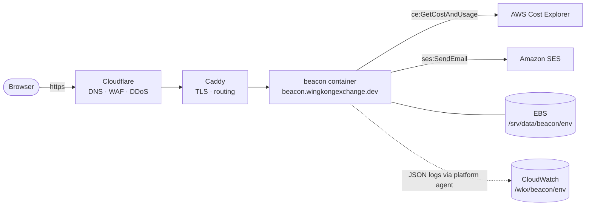
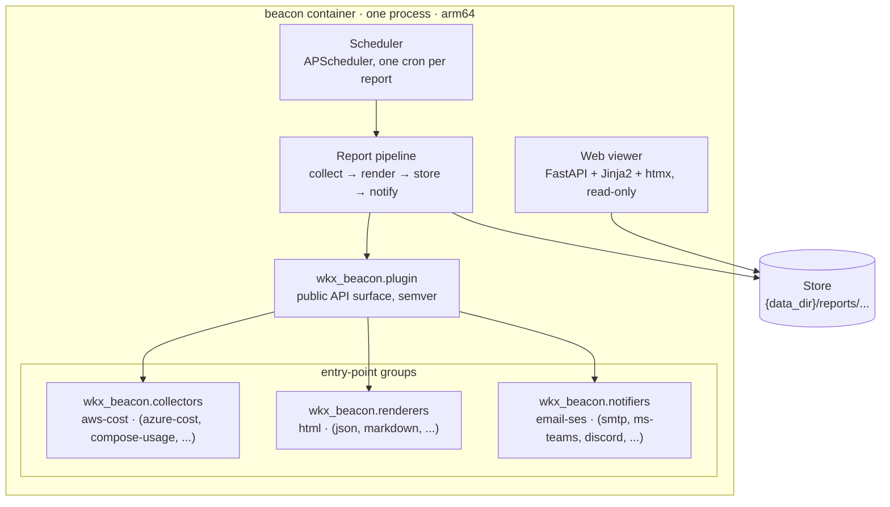
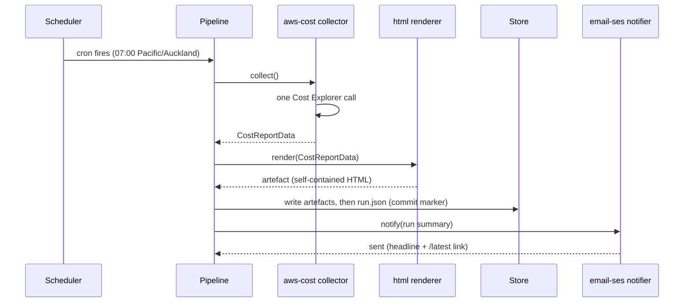

# wkx-beacon design

Date: 2026-07-04
Status: approved

## 1. Overview

wkx-beacon is an open-source, containerised Python web app that generates reports about the platform it runs on and announces them. It is built around a plugin framework with three seams: collectors gather data from a platform, renderers turn that data into artefacts, and notifiers announce finished reports on a channel. A scheduler fires report pipelines; an htmx web viewer serves the results.

The first deployment runs as a standard wkx app on the WKX Platform (see `wkx-platform`), and the MVP is one vertical slice through every seam:

- Report: the WKX Platform member account's AWS spend against its NZD $50/month budget.
- Collector: `aws-cost` (AWS Cost Explorer).
- Renderer: `html`.
- Notifier: `email-ses` (Amazon SES).
- Cadence: daily at 07:00 Pacific/Auckland.

### Goals

- A plugin API good enough to be the product: third parties add platforms, report types, formats, and channels without touching core.
- The MVP slice above, running on the WKX Platform.
- OSS quality: typed, tested, documented, per the conventions in the `python` reference repo (uv, ruff, pytest, ty, `src/` layout, Python 3.14).

### Non-goals (for the MVP)

- Other report types (test, AI eval, usage, error), other platforms (Azure, Docker Compose collectors), other formats, other channels. The seams exist; the implementations come later.
- Authentication and authorisation in beacon itself. The brief is that reports are protected by the authn/authz of the platform beacon runs on, if any. The WKX Platform has not yet decided its authn story, so the beacon viewer is public for now and beacon stays auth-agnostic. This is a deliberate deferral, not an omission.
- A database. The filesystem is the store.
- On-demand report generation from the viewer. Reports generate on schedule (plus a CLI one-shot for development).

## 2. Context

The WKX Platform is a personal Docker Compose platform: one Graviton EC2 instance (arm64) in `ap-southeast-2` fronted by Caddy and Cloudflare, plus an on-prem home server, within an NZD $50/month AWS budget. Apps are `wkx-<name>` repos deployed as Compose services. The platform activates the `Project`, `Env`, and `Service` cost-allocation tags, so per-service and per-env spend is queryable, which is exactly what the MVP report shows.

Beacon is the Service `beacon`: hostname `beacon.wingkongexchange.dev` (Mode 3, prod), Compose project `beacon-<env>`, SSM parameters under `/wkx/beacon/<env>/`, data dir `/srv/data/beacon/<env>`, log group `/wkx/beacon/<env>`.



## 3. Ubiquitous language

- **Report type**: the kind of question a report answers: `cost`, `test`, `ai-eval`, `usage`, `error`. Open-ended; plugins can introduce new ones.
- **Platform**: where beacon runs and what it reports on: `aws`, `azure`, `docker-compose`. A collector is specific to one (report type × platform) pair.
- **Collector**: a plugin that gathers data from a platform and returns typed report data. Owns the data contract for its report type.
- **Renderer**: a plugin that turns report data into an **artefact** (an HTML page now; PDF, Markdown, JSON later). Spelled `artifacts/` in code paths and URLs.
- **Notifier**: a plugin that announces a run on a channel (`email-ses` now; `smtp`, `ms-teams`, `discord` later).
- **Report**: a named, configured wiring of one collector, one or more renderers, one or more notifiers, and a schedule. Defined in `beacon.toml`.
- **Run**: one execution of a report, producing artefacts and a run record. A failed run is still a run.
- **Store**: the filesystem layout holding run records and artefacts. The only state beacon has.
- **Template pack**: the Jinja2 templates a collector plugin contributes so the `html` renderer can shape its report type.

## 4. Architecture

One container, one process. Core orchestrates; plugins do the work.



One run, end to end:



## 5. Plugin architecture

### Packaging and discovery

- Distribution `wkx-beacon` on PyPI; import package `wkx_beacon`.
- Three entry-point groups: `wkx_beacon.collectors`, `wkx_beacon.renderers`, `wkx_beacon.notifiers`.
- Built-in plugins (`aws-cost`, `html`, `email-ses`) live in this repo under `src/wkx_beacon/plugins/` but register through the same entry points, so the third-party path is exercised from day one.
- Third-party plugins are ordinary packages (for example `wkx-beacon-azure`) that register in the same groups. Discovery happens at startup via `importlib.metadata.entry_points()`.

### Contracts

`wkx_beacon.plugin` is the public, semver-governed API surface. Each plugin kind is a typed Protocol plus conventions:

- Every plugin declares a `name` (the string used in config, for example `"aws-cost"`) and a pydantic **config model**. At startup beacon validates each configured report's plugin config against the owning plugin's model.
- A **Collector** declares its `report_type` and `platform` and returns a pydantic `ReportData` subclass it owns. It contributes a template pack for its report type.
- A **Renderer** turns `ReportData` into artefacts. The `html` renderer dispatches on report type to the contributed template pack. Generic renderers (a future `json`) serialise any report type.
- A **Notifier** receives a completed run summary (report name, status, headline figures, artefact link) and delivers it. It never sees raw platform data.

### Configuration

Two layers, deliberately split:

- **Deployment settings** via environment variables (pydantic-settings, `BEACON_` prefix, `extra="forbid"`): data dir, base URL, log level and format, config file path.
- **Report wiring** via `beacon.toml`, because pipelines are structured data that does not fit env vars:

```toml
[[report]]
name = "platform-cost"
collector = "aws-cost"
renderers = ["html"]
notifiers = ["email-ses"]
schedule = "0 7 * * *"            # cron, in the configured timezone
timezone = "Pacific/Auckland"
catch_up = false                  # opt-in boot catch-up, default off

[report.collector_config]         # validated by the aws-cost plugin's model
budget = 50.0
budget_currency = "NZD"
display = "local-first"           # currency display: "usd" (default) or "local-first"
fx_usd_to_local = 1.64            # static, shown in report fine print
day_display = "local-first"       # date labels: "utc" (default) or "local-first"

[report.notifier_config.email-ses]
to = ["<recipient>"]
```

Report names are unique slugs (lowercase letters, digits, hyphens), validated at boot; a duplicate name is a boot error. The name is the report's identity, URL segment, and store directory: renaming a report detaches its history (the old directory stays on disk; the viewer ignores store directories that match no configured report).

Unknown plugin names, unknown config keys, and missing entry points are startup errors that list what was found versus what was expected. Beacon fails at boot, not at 07:00.

## 6. Runtime

### Scheduler

APScheduler inside the FastAPI process (started via lifespan). One timezone-aware cron trigger per report, `max_instances=1` so a slow run never stacks on itself. Boot catch-up is per-report config (`catch_up = true`), default off. When enabled, a report whose last successful run predates its previous scheduled fire time runs immediately on boot. When off, a missed fire stays missed until the next cron.

### Pipeline and failure model

Each run gets a run ID (UTC timestamp based). Stages run sequentially: collect, render, store, notify. Third-party exceptions are translated at the boundary into a `BeaconError` hierarchy (`CollectError`, `RenderError`, `NotifyError`). Within a run, boto3's standard retry mode absorbs transient blips; there is no pipeline-level retry queue (the next cron is tomorrow).

**A failed run is still a run.** It is recorded in the store with status and error summary, it appears in the viewer, and notifiers deliver a failure notice naming the failed stage instead of a report summary. Breakage is announced the same way spend is.

**Published and run status.** A run is **published** once its artefacts are stored. Status is one of three: `ok` (every stage clean), `degraded` (published, but a renderer or notifier failed), `failed` (not published). With multiple renderers, artefacts from the renderers that succeeded are stored and the run is degraded. A notify failure degrades the run; it never unpublishes it.

### Store

Filesystem only, no database:

```text
{data_dir}/reports/<report-name>/runs/<run-id>/
    run.json           # status, stage outcomes, timings, headline summary
    artifacts/
        report.html
```

`run.json` is written last, as the commit marker; the viewer ignores run directories without one. An in-memory index is built by scanning at startup and updated after each run. Retention is keep-everything for now; a daily HTML page and a small JSON file cost effectively nothing on the EBS volume.

### Health and observability

- `GET /healthz`: scheduler running and data dir writable. The Dockerfile `HEALTHCHECK` hits it.
- Logs: JSON to stdout (stdlib logging, configured once at the entry point) with `report` and `run_id` fields at every stage boundary, flowing to CloudWatch via the platform agent.
- No metrics endpoint in the MVP; run records are the metrics.
- Never log secrets or report contents; log identifiers.

## 7. Web viewer

Server-rendered Jinja2 with htmx for partial updates (history pagination, status-filter fragments). htmx is vendored into the image; no CDN at runtime, no JavaScript build chain. The viewer is strictly read-only over the store; it never triggers runs.

| Route | Purpose |
|---|---|
| `GET /` | Index: each report with latest run status and headline figures |
| `GET /reports/{name}` | Run history; htmx lazy-loads older pages |
| `GET /reports/{name}/latest` | Redirect to the latest published run; the stable link emails use |
| `GET /reports/{name}/runs/{run-id}` | Run permalink: metadata, stage outcomes, artefact |
| `GET /reports/{name}/runs/{run-id}/artifacts/{file}` | The raw artefact, served as-is |
| `GET /healthz` | Health check |

Artefacts are fully self-contained HTML (inline CSS, inline SVG/HTML charts, CSS-only tooltips, no external assets), so they render identically from the store, in the viewer, or saved to disk years later.

Public-page hygiene, since there is no authn yet: templates render no account IDs or ARNs, only tag values and dollar figures; the viewer sets conservative security headers (CSP, no-referrer, nosniff).

The visual design of the viewer and the cost report page was mocked during the design session: index rows with status pills; a run page with stat tiles (month-to-date, projected month-end, yesterday, budget), a budget meter with a projection tick, a 30-day daily spend bar chart, by-service and by-env breakdowns from the cost-allocation tags, and a table view for accessibility. Chart marks use a validated single-hue palette; beacon's amber brand colour is chrome only, never data.

## 8. MVP plugins

### aws-cost collector (cost × aws)

- One AWS Cost Explorer call per run: `GetCostAndUsage`, daily granularity, unblended cost, current month plus the previous 30 days, grouped by the `Service` and `Env` cost-allocation tags (Cost Explorer allows two group-bys per call; totals are derived by summing).
- Computes: month-to-date, latest complete billing day, per-tag breakdowns, untagged share, and projected month-end as a simple average of complete billing days extrapolated over the month. No forecast API; predictable and explainable.
- Cost: USD 0.01 per Cost Explorer request, roughly USD 0.30/month at one call per day.
- Returns `CostReportData`. Config: `budget`, `budget_currency`, `display`, `fx_usd_to_local`, and the group-by tag keys (defaulting to the platform's `Service` and `Env`).
- Credentials via the default AWS SDK resolution chain. How permissions are provisioned on the host is a wkx-platform decision, out of beacon's scope; beacon documents what it needs (`ce:GetCostAndUsage`, `ses:SendEmail`).

**Currency.** Cost Explorer only returns USD. Display is per-report config: `display = "usd"` (default) reports purely in USD; `display = "local-first"` shows local-currency figures first with USD alongside, converted at a configured static rate that appears in the report fine print. This deployment: NZD first at a configured rate (for example 1.64 NZD/USD), updated manually on occasion; drift of a few percent does not matter for a $50 budget signal.

**Billing days.** The source of truth is fixed and the display is configurable, mirroring currency. Billing data is always UTC calendar days and UTC months, the frame of the AWS invoice and the budget; projections and budget maths use complete UTC billing days, and "yesterday" means the latest complete billing day. `day_display = "utc"` (default) labels dates as UTC; `day_display = "local-first"` labels each billing day with the local date (in the report's timezone) that covers most of it, carries both dates in tooltips and the table view, and states the mapping in the fine print. A run in the early local morning of the 1st still reports the previous billing month; that is the month wrap-up, by design. This deployment: local-first, Pacific/Auckland.

### html renderer

- Renders the collector's template pack into a fully self-contained artefact, as described in §7.
- Renders no account identifiers; the page is public.

### email-ses notifier

- boto3 SES v2 in `ap-southeast-2`.
- Success: subject carries the headline (for example `beacon · platform-cost · $4.65 MTD, projected $48.05 of $50.00`), body is a short summary plus the stable `/latest` link.
- Failure: subject names the failed stage.
- Sender `beacon@wingkongexchange.dev`. The SES domain identity and its Cloudflare DNS records are a platform prerequisite (Terraform in wkx-platform). SES sandbox mode is acceptable: the recipient is the owner's verified address.

## 9. Repo layout and CLI

Per the `python` reference repo conventions: uv, ruff, pytest, ty, stdlib logging, Typer, `src/` layout, `pyproject.toml` as the single source of truth, Python 3.14, Google-style docstrings, full type signatures everywhere.

```text
wkx-beacon/
├── pyproject.toml            # deps + entry points registering the built-in plugins
├── uv.lock
├── .python-version           # 3.14
├── .env.example
├── beacon.toml               # this deployment's report wiring, baked into the image
├── Dockerfile                # arm64 first, multi-arch capable
├── compose.yml               # the wkx app contract
├── caddy.snippet
├── .github/workflows/ci.yml
├── .pre-commit-config.yaml
├── src/wkx_beacon/
│   ├── __init__.py
│   ├── __main__.py           # Typer CLI
│   ├── _logging.py
│   ├── exceptions.py
│   ├── config.py             # env settings + beacon.toml loader
│   ├── plugin/               # public API: protocols, ReportData, discovery
│   ├── pipeline.py
│   ├── scheduler.py
│   ├── store.py
│   ├── web/                  # FastAPI app, viewer templates, vendored htmx
│   └── plugins/              # built-ins: aws_cost, html, email_ses
└── tests/
```

CLI (Typer):

- `beacon serve`: scheduler + viewer; the container entrypoint.
- `beacon run <report>`: one-shot pipeline run for development and debugging. CLI-only; the viewer stays read-only.
- `beacon validate`: config + plugin discovery check; usable in CI.

Runtime dependencies: fastapi, uvicorn, jinja2, apscheduler, boto3, pydantic, pydantic-settings, typer. Dev: pytest, pytest-cov, ruff, ty, boto3 type stubs.

## 10. Testing

- No live AWS anywhere in the suite. Cost Explorer and SES run against botocore's `Stubber` with fixture responses.
- Renderer: golden-file tests against fixture `CostReportData`.
- Pipeline failure paths: deliberately-failing fake plugins registered through real entry points, which also proves the third-party discovery path.
- Viewer routes and htmx fragments: FastAPI `TestClient` over a fixture store.
- Plugin conformance checks ship as a reusable test kit, since the plugin API is the product; third parties get its tests.
- Conventions: Arrange-Act-Assert, parametrize over loops, `-ra --strict-markers --strict-config`, warnings as errors, typed test signatures.

## 11. CI and deployment

CI (GitHub Actions, per the reference template): ruff check, ruff format check, ty check, pytest with coverage, plus an arm64 Docker build.

Deployment follows the platform contract: git push, GitHub Actions (OIDC), ECR, `aws ssm send-command`, on-box `docker compose up -d`. The deploy workflow is inherited from the platform's reference project when the platform reaches that milestone. Until then, beacon runs locally with `docker compose up`, which is also the seed of its Docker Compose platform story.

## 12. Platform prerequisites (work in wkx-platform, not this repo)

- SES domain identity for `wingkongexchange.dev` with its DNS records in Cloudflare (Terraform).
- IAM permissions for `ce:GetCostAndUsage` and `ses:SendEmail`, provisioned by whatever per-app permission mechanism the platform decides on.
- Standard app plumbing: SSM parameters under `/wkx/beacon/<env>/`, data dir `/srv/data/beacon/<env>`, log group `/wkx/beacon/<env>`, Caddy snippet, DNS.

## 13. Decisions

| Decision | Choice | Notes |
|---|---|---|
| Audience | OSS, owner's use cases first | MVP slice: cost × aws × html × email |
| Run model | Scheduled generation + web viewer | No on-demand generation in the viewer |
| Architecture | Full plugin framework from day one | Entry points, typed Protocols, config-driven pipelines |
| Web stack | FastAPI + Jinja2 + htmx | htmx vendored; no JS build chain |
| Viewer authn | Public for now; beacon stays auth-agnostic | Platform authn/authz is a deferred wkx-platform decision |
| AWS credentials | Default SDK chain; provisioning deferred to platform | Beacon documents required permissions only |
| Email | Amazon SES | Domain identity is a platform prerequisite; sandbox acceptable |
| Cadence | Daily 07:00 Pacific/Auckland | Cost Explorer data updates roughly daily |
| Catch-up | Per-report opt-in, default off | |
| Currency | Configurable display; default USD; this deployment local-first NZD | Static configured FX rate in fine print |
| Store | Filesystem, `run.json` commit marker | No database |
| Package naming | `wkx-beacon` / `wkx_beacon` | Import name matches normalised distribution name |

## 14. Risks and open questions

- **Public cost data.** Spend patterns are visible to anyone with the URL until the platform authn decision lands. Mitigated by rendering no account identifiers; accepted for now.
- **Plugin API stability.** Committing to a public API before a second platform exists risks churn. Mitigated by semver on `wkx_beacon.plugin` and the conformance test kit; accepted as the cost of the plugin-first choice.
- **Cost Explorer latency.** Data lags up to about 24 hours; the daily report reflects that, and the projection maths uses complete UTC billing days only.
- **Platform timing.** The WKX Platform is pre-M1; beacon cannot deploy to prod until platform milestones land. Local Docker Compose is the interim runtime.
- **SES sandbox.** Fine for self-notification; leaving the sandbox is only needed if reports are ever emailed to arbitrary recipients.
